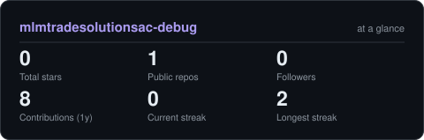

<!-- BANNER - terminal profile.sh --live (additive). Generated by scripts/banner/generate.py.
     ~0.7–0.8 MB each. Cache-bust with ?v=N after regenerating. -->
<picture>
  <source media="(prefers-color-scheme: dark)"  srcset="assets/banner-dark.v9.svg">
  <source media="(prefers-color-scheme: light)" srcset="assets/banner-light.v9.svg">
  
</picture>

 

<!-- NAME / TAGLINE - animated typing -->

 

<!-- SOCIALS — Puedes agregar tu enlace real de LinkedIn donde dice TU_URL_DE_LINKEDIN -->
&nbsp;&nbsp;

 

<!-- VIEWS COUNTER -->

---

## ¡Hola! 👋

Soy un desarrollador radicado en Perú 🇵🇪 enfocado en crear herramientas que solucionan problemas complejos, automatización financiera y arquitecturas escalables.

- 🏛️ **Desarrollo Web:** Creador de plataformas administrativas para control patrimonial gestionando más de 12,000 activos en el sector público usando **Python, Flask, SQLAlchemy y Pandas**.
- 📈 **Trading Algorítmico:** Configuración, testing en Strategy Tester y despliegue de bots de trading (EAs) para **MetaTrader 5** enfocados en el mercado del Oro (GOLD), integrando webhooks y Pine Script.
- 🤖 **IA & Herramientas:** Uso avanzado de asistentes de código (Gemini CLI, Claude Code, opencode) para acelerar el desarrollo.
- ⚙️ **Infraestructura:** Despliegues continuos evaluando servidores Linux dedicados, VPS y agentes launchd en macOS.

 

## Stack Principal

---

## Estadísticas 

<!-- Generated by scripts/cards.py into this repo. -->
<picture>
  <source media="(prefers-color-scheme: dark)"  srcset="assets/card-stats-dark.svg">
  <source media="(prefers-color-scheme: light)" srcset="assets/card-stats-light.svg">
  
</picture>

 

